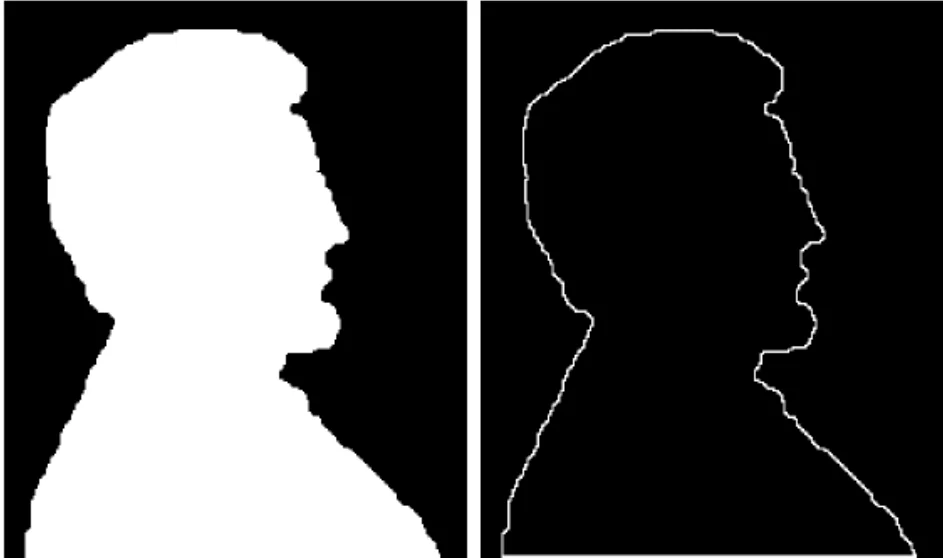

# Detecção de Bordas com WebGPU e Filtro de Sobel

Este é um projeto de detecção de bordas em imagens utilizando a tecnologia **WebGPU** e o **filtro de Sobel**. A aplicação permite que os usuários carreguem uma imagem, a qual é processada para realçar as bordas usando algoritmos eficientes executados na GPU.



---

## 🛠️ Tecnologias Utilizadas

- **React**: Framework para construção de interfaces modernas e reativas.
- **TypeScript**: Superset do JavaScript, adicionando tipagem estática ao projeto.
- **WebGPU**: API moderna de gráficos e computação para execução direta na GPU.
- **WGSL**: Linguagem de shaders usada em WebGPU para cálculos paralelos.

---

## 🚀 Funcionalidades

1. **Upload de Imagens**:
   - O usuário pode carregar uma imagem diretamente do dispositivo.

2. **Processamento de Bordas**:
   - A imagem é processada utilizando o filtro de Sobel, implementado em **WGSL** e executado com **WebGPU**.

3. **Visualização em Tempo Real**:
   - Exibição da imagem original e da imagem processada no navegador.

4. **Responsividade**:
   - Interface amigável e responsiva para diferentes tamanhos de tela.

---
## 🖥️ Pré-requisitos
- Certifique-se de que seu ambiente suporta WebGPU:
- Navegadores suportados: Chrome (com a flag chrome://flags/#enable-unsafe-webgpu) ou Edge.
- Node.js (versão >= 20).

## 🔧 Como Executar

Instale as dependências:

```bash
yarn
```

Inicie o servidor de desenvolvimento:

```bash
yarn dev
```

Acesse a aplicação: Abra o navegador em http://localhost:5173/.

## 🤝 Contribuições
Contribuições são bem-vindas! Se você tiver sugestões ou melhorias, sinta-se à vontade para abrir uma issue ou enviar um pull request.